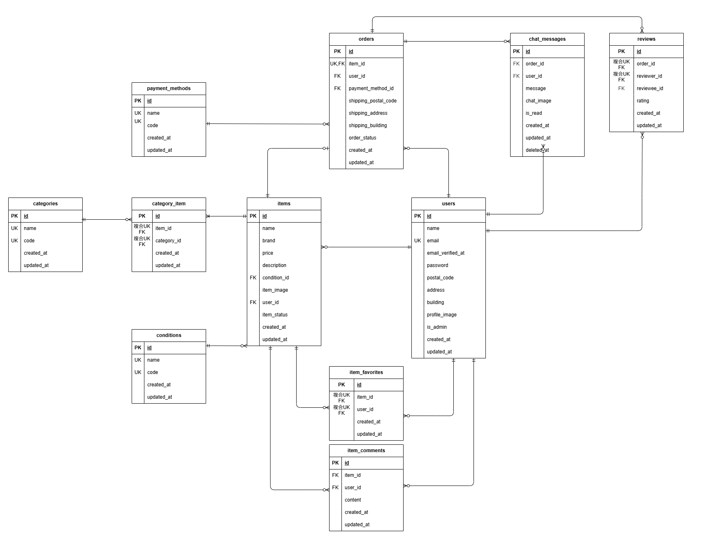

# coachtechフリマ

## 環境構築
1. リポジトリをクローン 
    ```bash
    `git clone git@github.com:kawamata-natsuki/coachtech-flea.git`
    ```
2. `.env`ファイルの準備
    ```bash
    `cp .env.docker.example .env`
    ```
    ※`.env`ファイルはDocker用の設定ファイルです。
      自分の環境に合わせて`.env`の`UID/GID`を設定してください。
    ※Linux/macOSの場合、以下のコマンドで確認できます：
      ```bash
      id -u  # UID
      id -g  # GID
      ```

3. `docker-compose.override.yml`の作成

    ```bash
    `touch docker-compose.override.yml`
    ```
    ※`docker-compose.override.yml`はGit管理対象外なので、各自の環境に合わせて作成してください。
    ```yaml
    services:
      nginx:
        ports:
          - "8084:80"

      php:
        user: "${UID}:${GID}"

      phpmyadmin:
        ports:
          - 8085:80
    ```

4. Dockerイメージのビルドと起動
    ```bash
    docker-compose up -d --build
    ```
    > MacのM1・M2チップのPCの場合、`no matching manifest for linux/arm64/v8 in the manifest list entries`のメッセージが表示されビルドができないことがあります。
    エラーが発生する場合は、`docker-compose.yml`ファイルの`mysql`に以下のように追記してください
    ```yaml
    mysql:
        platform: linux/x86_64(この行を追加)
        image: mysql:8.0.26
        environment:
    ```
5. Laravelのセットアップ

    PHPコンテナに入ります
    ```bash
    docker-compose exec php bash
    ```

    Composerのインストール
    ```bash
    composer install
    ```

    アプリケーションキーの生成
    ```bash
    php artisan key:generate
    ```

6. `.env`ファイルの設定

    `.env`ファイルに以下の内容を追記・修正してください：

    #### メール設定
    
    メール認証はMailtrapを使用しています。
    Mailtrapのアカウントをお持ちでない場合は、https://mailtrap.io から無料登録し、
    自身の受信箱に記載の `MAIL_USERNAME` と `MAIL_PASSWORD` を `.env` に設定してください。
    ```ini
    MAIL_MAILER=smtp
    MAIL_HOST=sandbox.smtp.mailtrap.io
    MAIL_PORT=2525
    MAIL_USERNAME=your_mailtrap_username_here
    MAIL_PASSWORD=your_mailtrap_password_here
    MAIL_ENCRYPTION=null
    MAIL_FROM_ADDRESS=no-reply@example.com
    MAIL_FROM_NAME="${APP_NAME}"  
    ```
    #### Stripe設定

    Stripeのアカウントをお持ちでない場合は、[https://dashboard.stripe.com/register](https://dashboard.stripe.com/register) から無料登録し、
    テスト用APIキー（公開キー・秘密キー）を取得して `.env` に設定してください。
    ```ini
    STRIPE_KEY=your_stripe_public_key_here
    STRIPE_SECRET=your_stripe_secret_key_here
    ``` 
    
    ### 補足：Stripe テストカード番号（決済テスト用）
    - 成功：4242 4242 4242 4242  
    - 失敗：4000 0000 0000 9995  
    - 有効期限：任意の未来日（例：04/34）  
    - CVC：適当な3桁（例：123）
    
7.  権限設定

    `storage`および`bootstrap/cache`に適切な権限を設定します。
    `src`ディレクトリに移動し、以下のコマンドを実行してください。
    ```bash
    sudo chmod -R 775 storage
    sudo chmod -R 775 bootstrap/cache
    ```

8. `.gitignore`の修正

    `.gitignore`をプロジェクトのルートディレクトリ（最上位のディレクトリ）に移動させます
    ```bash
    `mv .gitignore ../`
    ```
    `.gitignore`に以下の項目を追加してください。
    ```
    /src/node_modules
    /src/public/hot
    /src/public/storage
    /src/storage/*.key
    /src/vendor
    /src/.env
    /src/.env.backup
    /src/.phpunit.result.cache
    /src/Homestead.json
    /src/Homestead.yaml
    /src/npm-debug.log
    /src/yarn-error.log
    /src/.idea
    /src/.vscode
    /docker/mysql/data/
    docker-compose.override.yml
    .env
    ```

9. マイグレーションの実行
    ```bash
    php artisan migrate
    ```

10. シーディングの実行
    ```bash
    php artisan db:seed
    ```

11. ストレージのシンボリックリンク作成

    `public/storage` を `storage/app/public` にリンクするためのコマンドです
    画像ファイルを`storage/app/public/items/abc.jpg`に保存しておくと、 
    ブラウザから`http://localhost/storage/items/abc.jpg`のようにアクセス可能になります
    ```bash
    php artisan storage:link
    ```

## テスト実行方法まとめ

### Featureテスト（PHPUnit）

主にバリデーションやコントローラーのロジックを検証します。

1. `.env.testing.example` をコピーして `.env.testing` を作成
    ※ `.env.testing.example` はテスト専用の設定テンプレートです。
   ```bash
   cp .env.testing.example .env.testing
   ```

2. マイグレーション（テスト用DB）
    ```
    php artisan migrate --env=testing
    ```

3. テスト実行
    ```
    php artisan test
    もしくは
    ./vendor/bin/phpunit
    ```

### Laravel Dusk を使ったブラウザテスト

実際のブラウザ操作を通して、UIの挙動や画面遷移などを確認します。

1. Laravel Duskのセットアップ
    ```bash
    composer require --dev laravel/dusk
    php artisan dusk:install
    ```

2. `.env.dusk.local.example` をコピーして `.env.dusk.local` を作成
    ※ `.env.dusk.local.example` はDusk専用のローカル環境テンプレートです。
    ```
    cp .env.dusk.local.example .env.dusk.local
    ```
    
3.  dusk コンテナでマイグレーション実行（※テスト用DBに対して）
    ```
    docker compose exec dusk php artisan migrate
    ```

4.  Dusk テストの実行
    ```
    docker compose exec dusk php artisan dusk
    ```

### 画像アップロードのテストについて

    このプロジェクトでは画像アップロードのテストに `UploadedFile::fake()->image(...)` を使用しており、PHPのGDライブラリが必要になります。
    DockerfileでGDはインストール済みのため、特別な対応は不要です。

## ログイン情報一覧
※ログイン用のテストアカウントです。氏名・住所などはダミーデータを使用しています。
※管理者ユーザーは管理画面が存在しないため、ログイン確認用アカウントとしてのみ作成しています。


| ユーザー種別     | メールアドレス         | パスワード   |
|------------------|--------------------------|--------------|
| 一般ユーザー①    | mario@example.com         | 12345678     |
| 一般ユーザー②    | link@example.com          | 12345678     |
| 一般ユーザー③    | pupupu@example.com        | 12345678     |
| 管理者ユーザー   | admin@example.com         | admin1234    |

## 使用技術(実行環境)
- Laravel Framework 8.83.29
- PHP 8.4.3
- MYSQL 8.0.26
- Nginx 1.21.1
- phpMyAdmin 8.2.27

## ER図


## URL
- 開発環境：http://localhost/
- データベース：http://localhost:8080

  ※ポート番号は`docker-compose.override.yml`で各自調整してください。


## 【補足】会員登録について

### バリデーションエラーについて
仕様書に加えて、以下のルールとメッセージを追加しています：
※すべての入力値に対して `string` を指定し、不正な配列入力などを防止しています。

- name：
  - `required`（基本設計書にユーザー名がなかったため）
  - `max:50`（レイアウト崩れ防止のため）
  - `string`
- email：
  - `max:255`
  - `unique:users,email`（既存メールアドレスとの重複チェック）
  - `string`
- password：
  - `confirmed`（確認用パスワードとの一致チェック）
  - `string`
- password_confirmation：
  - `required`（確認用パスワードのフォーム直下にエラー表示させるため）

### プレースホルダーについて
プレースホルダーはUI補助として追加しています。
以下のとおり簡単な入力例を表示しています

【placeholder文言一覧】
- name                  ： 例：山田　太郎
- email                 ： 例：user@example.com
- password              ： 8文字以上のパスワードを入力
- password_confirmation ： もう一度パスワードを入力

### メール認証について
- Mailtrap を使用しています（設定は `.env` を参照）

## 【補足】ログインについて

### バリデーションエラーについて
仕様書に加えて、`string`のルールを追加し、不正な配列入力などを防止しています。

### プレースホルダーについて
プレースホルダーはUI補助として追加しています。
以下のとおり簡単な入力例を表示しています

【placeholder文言一覧】
- email                 ： 例：user@example.com
- password              ： 8文字以上のパスワードを入力

## 【補足】ヘッダーについて

### ヘッダーロゴのリンク対応
仕様書には記載がありませんでしたが、ユーザーがトップページに戻りやすくなるよう、ヘッダーロゴにトップページへのリンクを設定しています。
※クライアント（コーチ）へ相談、承諾済です。

### 検索窓について
Figma上のデザインには検索窓のみで検索ボタンはありませんでしたが、
リアルタイム検索の実装が難しかったため、明示的な検索ボタンを追加しています。
ユーザーがキーワード入力後に確実に検索を実行できるよう、UXを重視した対応です。
※クライアント（コーチ）へ相談、承諾済です。


            // 商品データ一覧には'user_id' 'item_status'はありませんが、テーブル設計の都合で追加しています（READMEに記載する）